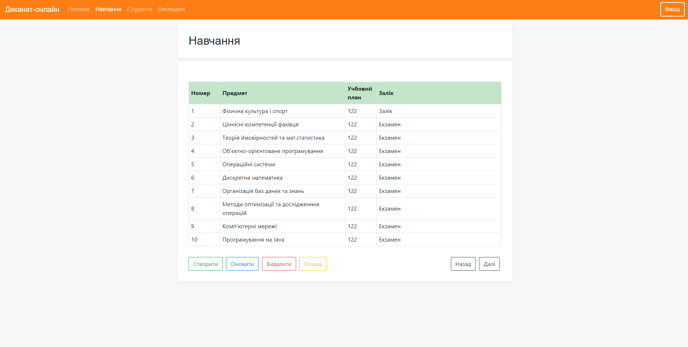

# Deanery-online
Deanery-online — веб-приложение, серверная часть которого написана на Java с использованием каркаса Spring.
Приложение предназначено для студентов и работников деканата. Проект был сделан в качестве курсовой работы по предмету "Организация баз данных".
# Описание
Приложение позволяет студентам узнавать свой учебный план и расписание на неделю, вносить про себя информацию в карту и изменять ее.
Работники деканата могут изменять основную информацию, которая отображается студентам (расписание, список предметов, преподаватели, информация о студенте).
В будущем функционал приложения возможно будет дополняться.
# Используемые технологии

# Внешний вид страниц

# Страницы администратора

